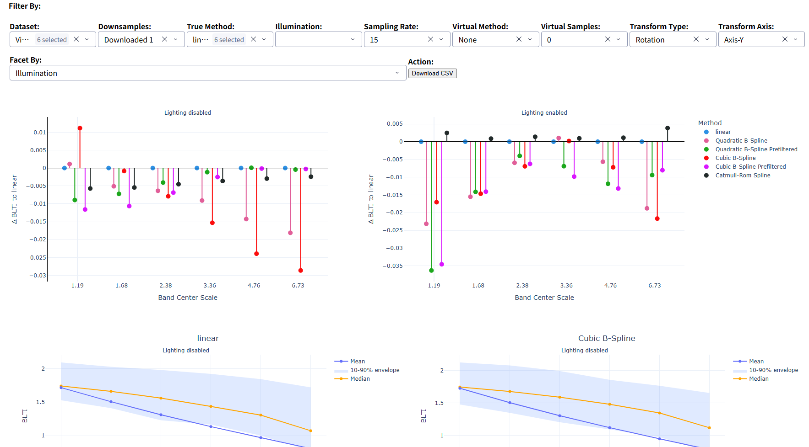

# BLTI Evaluation and Visualization

This repository provides a complete pipeline for collecting temporal rendering data, computing the BLTI metric, and interactively visualizing the results.

The project consists of three main components:

1. **Temporal Data Collection**
2. **BLTI Metric Computation**
3. **Interactive Data Visualization**

---

## Requirements

### Software

- Python 3.x
- [Raycast](https://github.com/JensDerKrueger/VirtualSampling)

### Python Dependencies

Install all required Python packages using:

```bash
pip install -r requirement.txt
```

---

## Project Workflow

The complete workflow is:

```text
Raycast
   |
   | temporal.gsc
   v
Temporal Rendering Data
   |
   | blti.py
   v
BLTI Results
   |
   | app.py
   v
Interactive Visualization
```
<!-- 
In detail:

```text
Data Collection
      |
      v
Rendering Sequences
      |
      v
BLTI Metric Computation
      |
      v
Parquet / CSV Results
      |
      v
Dash Visualization
      |
      v
Interactive Analysis
``` -->

---

# 1. Temporal Data Collection

The first step is to collect temporal rendering data using Raycast.

Run the following command:

```bash
Raycast.exe --script ./gsc/temporal.gsc
```

The `temporal.gsc` script controls the temporal rendering process and generates the required rendering sequences.
<!-- 
Make sure that:

- `Raycast.exe` is available.
- `temporal.gsc` is correctly configured.
- All required Raycast resources and scene files are available.
- The output directory has sufficient disk space. -->

After the data collection process is completed, the generated rendering sequences can be used as input for the BLTI computation.

---

# 2. BLTI Metric Computation

The second step is to calculate the BLTI metric from the collected rendering sequences.

The main script is:

```text
blti.py
```

## Basic Usage

```bash
python blti.py -i <sequence_dir>
```

For example:

```bash
python blti.py -i ./sequences
```

## Command-Line Arguments

| Argument | Description |
|----------|-------------|
| `-i`, `--input` | Input directory containing the rendering sequences |
| `-o`, `--output` | Output directory for the computed BLTI results. Default: `temporal_data` |
| `--output-format` | Output format: `parquet` or `csv`. Default: `parquet` |
| `--multi-process` | Enable multiprocessing |
| `--workers` | Number of worker processes. Default: `8` |
| `--batch-size` | Number of frames processed per batch. Default: `100` |

## Recommended Data Format

For large datasets, **Parquet** is recommended instead of CSV.

Use:

```bash
--output-format parquet
```

because Parquet is generally more suitable for analytical workloads and can be efficiently processed by Polars.

The visualization application is designed to work with the generated Parquet files.

---

## Performance Considerations

BLTI computation can be computationally intensive, especially for large rendering sequences.

For systems with multiple CPU cores, multiprocessing can be enabled. And the number of workers should be selected according to the available CPU cores and system memory.

```bash
python blti.py \
    -i ./sequences \
    -o ./data \
    --output-format parquet \
    --multi-process \
    --workers 24 \
    --batch-size 2880
```

<!-- 
## Output Format

The BLTI results can be saved in either Parquet or CSV format.

### Parquet

```bash
python blti.py \
    -i ./sequences \
    -o ./data \
    --batch-size 2880
```

Parquet is recommended for large datasets and for use with the visualization application.

### CSV

```bash
python blti.py \
    -i ./sequences \
    -o ./data \
    --output-format csv
```

CSV can be useful when the results need to be inspected or processed by other software.

## Multiprocessing

For faster computation, multiprocessing can be enabled with:

```bash
--multi-process
```

For example:

```bash
python blti.py \
    -i ./sequences \
    -o ./data \
    --output-format parquet \
    --multi-process
```

The number of worker processes can be configured using:

```bash
--workers
```

For example:

```bash
python blti.py \
    -i ./sequences \
    -o ./data \
    --output-format parquet \
    --multi-process \
    --workers 24
```

The default number of workers is `8`.

## Batch Size

The number of frames processed in each batch can be configured using:

```bash
--batch-size
```

The default batch size is:

```text
100
```

For example:

```bash
python blti.py \
    -i ./sequences \
    -o ./data \
    --output-format parquet \
    --multi-process \
    --workers 8 \
    --batch-size 2880
```

The optimal batch size depends on the available system memory and the size of the input data. -->

---

# 3. Interactive Data Visualization

The third component is an interactive web application based on Dash.

The application is implemented in:

```text
app.py
```

It can be used to explore and analyze the computed BLTI results interactively.



## Start the Visualization Application

Run:

```bash
python app.py -d <data_dir>
```

For example:

```bash
python app.py -d ./data
```

The `-d` argument specifies the directory containing the generated Parquet files.

The application scans the specified directory for Parquet files and loads them for visualization.

## Open the Web Application

After starting the application, open a web browser and navigate to:

```text
http://127.0.0.1:8050
```
<!-- 
Alternatively:

```text
http://localhost:8050
``` -->

The Dash application will then display the interactive BLTI visualization.

---

# Visualization Features

The visualization application provides several interactive features.

## Filtering

The results can be filtered using dropdown menus.

Available filters include parameters such as:

- Dataset
- Downsamples
- Method
- Lighting
- True samples
- Virtual sampling method
- Virtual samples
- Transformation type
- Transformation axis

The available filters depend on the input dataset.

## Faceting

The visualization can be grouped by different dimensions using the **Facet By** dropdown.

This allows different experimental conditions to be compared separately.

## BLTI Visualization

The main visualization displays BLTI values across different frequency bands.

The visualization can show:

- Mean BLTI
- Median BLTI
- 10th percentile
- 90th percentile
- Differences relative to the linear sampling baseline

## Sampling Method Comparison

Different sampling methods can be compared interactively.

The application uses the linear sampling method:

```text
lin-none
```

as the baseline for comparison.

The difference is visualized as:

```text
Δ BLTI to linear
```

## CSV Export

The filtered results can be exported using the:

```text
Download CSV
```

button.

This allows the selected data to be downloaded for further analysis.

---

<!-- # Complete Example

A typical complete workflow is shown below.

## Step 1: Install Dependencies

```bash
pip install -r requirements.txt
```

## Step 2: Collect Temporal Data

```bash
Raycast.exe --script temporal.gsc
```

After the process finishes, the rendering sequences should be available in the configured sequence directory.

## Step 3: Compute BLTI

For example:

```bash
python blti.py \
    -i ./sequences \
    -o ./data \
    --output-format parquet \
    --multi-process \
    --workers 8 \
    --batch-size 2880
```

This generates the BLTI results in the `./data` directory.

## Step 4: Start the Visualization Server

```bash
python app.py -d ./data
```

## Step 5: Open the Dashboard

Open the following URL:

```text
http://127.0.0.1:8050
```

You can then use the filters and visualization controls to explore the BLTI results. -->
<!-- 
---

# Project Structure

A typical project structure is:

```text
.
├── app.py
├── blti.py
├── temporal.gsc
├── requirements.txt
├── README.md
│
├── sequences/
│   └── ...
│
└── data/
    ├── part_00000.parquet
    ├── part_00001.parquet
    └── ...
```

The exact directory structure may vary depending on the configuration of the data collection and metric computation steps. -->

# Troubleshooting

<!-- ## Python Module Not Found

If you encounter an error such as:

```text
ModuleNotFoundError
```

make sure that the required dependencies have been installed:

```bash
pip install -r requirements.txt
```

## No Parquet Files Found

If the visualization application does not display any data, check that the specified directory contains `.parquet` files:

```bash
python app.py -d ./data
```

The directory should contain files such as:

```text
data/
├── result_001.parquet
├── result_002.parquet
└── result_003.parquet
``` -->

## Port Already in Use

If port `8050` is already being used by another application, stop the existing process or configure the Dash application to use another port.

For example:

```python
app.run(
    debug=True,
    host="0.0.0.0",
    port=8051,
)
```

The application can then be accessed at:

```text
http://127.0.0.1:8051
```

---

# Summary

The three main components of this project can be summarized as follows:

| Component | Command | Purpose |
|-----------|---------|---------|
| Data Collection | `Raycast.exe --script temporal.gsc` | Collect temporal rendering sequences |
| BLTI Computation | `python blti.py -i <sequence_dir>` | Calculate BLTI metrics |
| Visualization | `python app.py -d <data_dir>` | Interactively explore BLTI results |

The recommended workflow is:

```text
1. Collect rendering data
        ↓
2. Compute BLTI metrics
        ↓
3. Save results as Parquet
        ↓
4. Start the Dash application
        ↓
5. Open http://127.0.0.1:8050
        ↓
6. Filter, compare, visualize, and export results
```

---
<!-- 
# Academic Use

This repository was developed for academic and research purposes, with the goal of evaluating temporal coherence and comparing different rendering and sampling methods using the BLTI metric. -->
